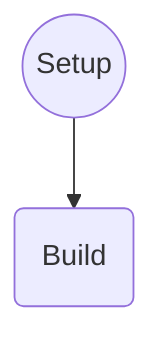

# Robótica 2025-I Laboratorio No. 01 🤖🐢
***Intro a ROS 2 Humble - Turtlesim***  
  
Maria Lucia Arias Ortiz - `mariasor@unal.edu.co`  
Andrés Felipe Quenan Pozo - `aquenan@unal.edu.co`
***

# Diagrama de flujo del controlador de la tortuga

