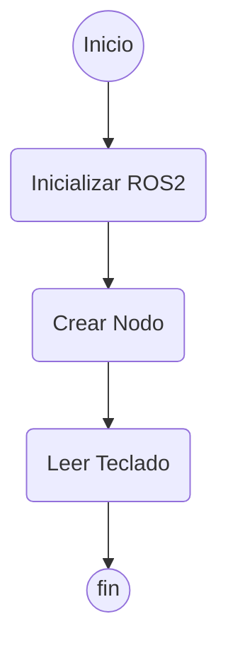
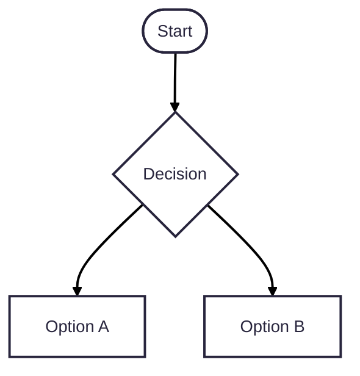

# Robótica 2025-I Laboratorio No. 01 🤖🐢
***Intro a ROS 2 Humble - Turtlesim***  
  
Maria Lucia Arias Ortiz - `mariasor@unal.edu.co`  
Andrés Felipe Quenan Pozo - `aquenan@unal.edu.co`
***
# Introducción
El presente trabajo tiene como objetivo explorar y aplicar conceptos básicos de control de robots móviles utilizando el simulador Turtlesim en ROS 2. Se desarrolla un nodo que permite controlar el movimiento de una tortuga virtual mediante la lectura de teclas del teclado, enviando comandos de velocidad en tiempo real. Además, se implementa la capacidad de dibujar trayectorias específicas mediante secuencias programadas de movimientos lineales y rotacionales.
Este ejercicio permite afianzar conocimientos sobre el sistema de comunicación de ROS 2, desarrolla habilidades de programación en Python, manipulación de mensajes ROS, y control básico de un robot móvil.

# Objetivos
* Implementar un controlador de teclado en Python que capture entradas en tiempo real y genere comandos de movimiento para la tortuga.
* Programar movimientos básicos de la tortuga en respuesta a las flechas del teclado (avanzar, retroceder, girar a la izquierda y girar a la derecha)
* Diseñar funciones específicas que permitan a la tortuga trazar las letras "A", "F", "Q", "P", "M", "L" y "O" correspondientes a las iniciales de nombres y apellidos de los integrantes, a partir de combinaciones de movimientos lineales y rotacionales.

# Procedimiento

## Diagrama de flujo del controlador de la tortuga

