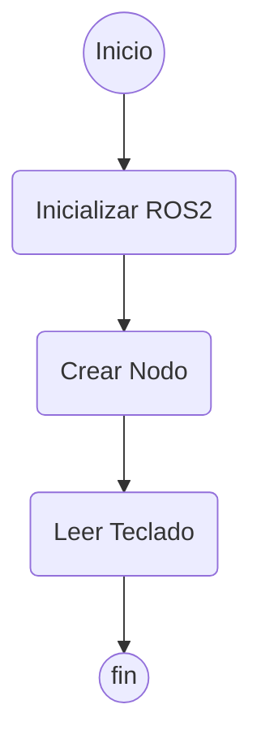

# Robótica 2025-I Laboratorio No. 01 🤖🐢
***Intro a ROS 2 Humble - Turtlesim***  
  
Maria Lucia Arias Ortiz - `mariasor@unal.edu.co`  
Andrés Felipe Quenan Pozo - `aquenan@unal.edu.co`
***
A continuación se explica el desarrollo del laboratotio 1. 
# Diagrama de flujo del controlador de la tortuga

---
config:
      theme: redux
---
flowchart TD
        A(["Start"])
        A --> B{"Decision"}
        B --> C["Option A"]
        B --> D["Option B"]

holaaa
Inicio
⬇️
Inicializar ROS2
⬇️
Crear Nodo TurtleController
⬇️
Iniciar un hilo para leer el teclado (keyboard_loop)
⬇️
Mientras el programa esté corriendo:
→ Esperar una tecla
→ Si es una flecha: mover la tortuga
→ Si es una letra (A, F, Q, etc.): dibujar la letra correspondiente
→ Si es Ctrl+C: salir
⬇️
Destruir el nodo
⬇️
Shutdown de ROS2
⬇️
Fin

