# Robótica 2025-I Laboratorio No. 01 🤖🐢 
***Intro a ROS 2 Humble - Turtlesim***  
  
Maria Lucia Arias Ortiz - `mariasor@unal.edu.co`  
Andrés Felipe Quenan Pozo - `aquenan@unal.edu.co`
***
# Introducción
El presente trabajo tiene como objetivo explorar y aplicar conceptos básicos de control de robots móviles utilizando el simulador Turtlesim en ROS 2. Se desarrolla un nodo que permite controlar el movimiento de una tortuga virtual mediante la lectura de teclas del teclado, enviando comandos de velocidad en tiempo real. Además, se implementa la capacidad de dibujar trayectorias específicas mediante secuencias programadas de movimientos lineales y rotacionales.
Este ejercicio permite afianzar conocimientos sobre el sistema de comunicación de ROS 2, desarrolla habilidades de programación en Python, manipulación de mensajes ROS, y control básico de un robot móvil.

# Objetivos
* Implementar un controlador de teclado en Python que capture entradas en tiempo real y genere comandos de movimiento para la tortuga.
* Programar movimientos básicos de la tortuga en respuesta a las flechas del teclado (avanzar, retroceder, girar a la izquierda y girar a la derecha)
* Diseñar funciones específicas que permitan a la tortuga trazar las letras "A", "F", "Q", "P", "M", "L" y "O" correspondientes a las iniciales de nombres y apellidos de los integrantes, a partir de combinaciones de movimientos lineales y rotacionales.

# Procedimiento
El script `move_controller.py` crea un nodo de ROS2, un publisher que envia mensajes tipo Twist y un timer que llama a la función `control_loop` cada 0.1 segundos, cuando sale de dicha función se destruye el nodo y se termina el programa.  
A continuación se muestra el diagrama de flujo general:

El procedimiento consta de los siguientes pasos:
## 1. Inicializar nodo:
En la función main se inicia ROS2, luego se crea una instancia del nodo `TurtleController()`, posteriormente el programa entra en un bucle esperando comandos y cuando termina destruye el nodo y apaga ROS2.

```
def main(args=None):
    rclpy.init(args=args)
    node = TurtleController()
    rclpy.spin(node)
    node.destroy_node()
    rclpy.shutdown()
```
## 2. Definir la clase TurtleController:
Se define la clase TurtleController que hereda de Node luego se crea un publisher que publica mensajes Twist en el tópico `/turtle1/cmd_vel.` y por último se crea un timer que cada 0.1 segundos llama a la función `control_loop`.
```
class TurtleController(Node):
    def __init__(self):
        super().__init__('turtle_controller')
        self.publisher_ = self.create_publisher(Twist, '/turtle1/cmd_vel', 10)
        self.timer = self.create_timer(0.1, self.control_loop)
```
## 3. Función `control_loop` 
Se lee una tecla presionada y se asigna a la variable `key` y se crea un mensaje Twist vacío para configurar el movimiento
```
def control_loop(self):
        key = get_key()
        msg = Twist()
```
Para el movimiento con las flechas la tecla se reconoce como los carácteres `\x1b` seguido de [A para avanzar, de [B para retroceder, de [C para girar a la derecha y de [D para girar a la izquierda. Dependiendo de cada tecla se configura el mensaje Twist con movimiento lineal o rotación para mover la tortuga.
```
         if key == '\x1b':  # Si es una flecha (escape character)
            key2 = get_key()
            key3 = get_key()
            if key3 == 'A':  # Flecha arriba
                msg.linear.x = 2.0
                msg.angular.z = 0.0
                self.get_logger().info('Avanzando')
            elif key3 == 'B':  # Flecha abajo
                msg.linear.x = -2.0
                msg.angular.z = 0.0
                self.get_logger().info('Retrocediendo')
            elif key3 == 'C':  # Flecha derecha
                msg.linear.x = 0.0
                msg.angular.z = -2.0
                self.get_logger().info('Girando a la derecha')
            elif key3 == 'D':  # Flecha izquierda
                msg.linear.x = 0.0
                msg.angular.z = 2.0
                self.get_logger().info('Girando a la izquierda')
```
Si la tecla es `a, f, q, p, m, l, o` se llama a la función de dibujo correspondiente.
```
        elif key.lower() == 'a':
            self.draw_A()
        elif key.lower() == 'f':
            self.draw_F()
        elif key.lower() == 'q':
            self.draw_Q()
        elif key.lower() == 'p':
            self.draw_P()
        elif key.lower() == 'm':
            self.draw_M()
        elif key.lower() == 'l':
            self.draw_L()
        elif key.lower() == 'o':
            self.draw_O()
```
Si la tecla es `x` se publica el mensaje 'Cerrando programa' y se cierra el nodo.
```
elif key == 'x':
            self.get_logger().info('Cerrando programa')
            rclpy.shutdown()
```
A continuación se muestra el diagrama de flujo de la función:

```mermaid
flowchart TD
    n1(["Inicio"]) --> n2["Capturar tecla"]
    n2 --> n3["Crear mensaje vacío"]
    n3 --> n4["Capturar tecla == flecha?"]
    n4 --- n5["Sí"] & n8["No"]
    n5 --> n6["Hacer trayectoria"]
    n6 --> n7["Configurar y publicar mensaje"]
    n8 --> n9["Capturar tecla == tecla especial?"]
    n9 --- n10["Sí"] & n11["No"]
    n11 --> n12["Capturar tecla == x?"]
    n12 --- n13["Sí"] & n15["No"]
    n13 --> n14["Fin"]
    n15 --> n2
    n10 --> n16["Función de dibujo"]
    n16 --> n17["Configurar y publicar mensaje"]
    n7 --> n2
    n17 --> n2

    n2@{ shape: subproc}
    n4@{ shape: decision}
    n5@{ shape: text}
    n8@{ shape: text}
    n9@{ shape: decision}
    n10@{ shape: text}
    n11@{ shape: text}
    n12@{ shape: decision}
    n13@{ shape: text}
    n15@{ shape: text}
    n14@{ shape: terminal}
    n16@{ shape: subproc}
    classDef green fill:#B2DFDB,stroke:#00897B,stroke-width:2px
    classDef orange fill:#FFE0B2,stroke:#FB8C00,stroke-width:2px
    classDef blue fill:#BBDEFB,stroke:#1976D2,stroke-width:2px
    classDef yellow fill:#FFF9C4,stroke:#FBC02D,stroke-width:2px
    classDef pink fill:#F8BBD0,stroke:#C2185B,stroke-width:2px
    classDef purple fill:#E1BEE7,stroke:#8E24AA,stroke-width:2px
    style n1 stroke:#000000,stroke-width:1px,stroke-dasharray: 0
    style n2 stroke-width:1px,stroke-dasharray: 0,stroke:#000000
    style n3 stroke-width:1px,stroke-dasharray: 0,stroke:#000000
    style n4 stroke-width:1px,stroke-dasharray: 0,stroke:#000000
    style n6 stroke-width:1px,stroke-dasharray: 0,stroke:#000000
    style n7 stroke-width:1px,stroke-dasharray: 0,stroke:#000000
    style n9 stroke-width:1px,stroke-dasharray: 0,stroke:#000000
    style n12 stroke-width:1px,stroke-dasharray: 0,stroke:#000000
    style n14 stroke-width:1px,stroke-dasharray: 0,stroke:#000000
    style n16 stroke-width:1px,stroke-dasharray: 0,stroke:#000000
    style n17 stroke-width:1px,stroke-dasharray: 0,stroke:#000000
```

## 4. Funciones de dibujo
Teniendo en cuenta que la función `linear.x` controla la velocidad lineal, `angular.z` controla la velocidad angular y `self.wait()` controla el tiempo durante el cual se ejecuta los movimientos, se realiza diferentes trazos teniendo en cuenta la posición y orientación de la tortuga en cada tramo para describir las trayectorias. En cada letra a continuación se describe los pasos para construir la trayectoria considerando que la orientación inicial es hacia la derecha
### Letra A:


